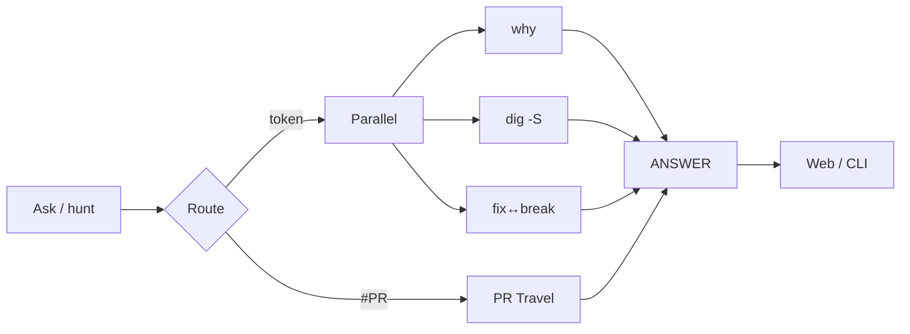

<p align="center">
  
</p>

<h1 align="center">Timeforge</h1>

<p align="center">
  <strong>Repo Time Machine</strong> — ask one question about any Git history.<br/>
  Who broke it · when it appeared · who still owns it · in ~10ms.
</p>

<p align="center">
  <a href="https://github.com/FounderB/Timeforge/actions"></a>
  <a href="LICENSE"></a>
  
  
</p>

<p align="center">
  <a href="https://github.com/FounderB/FluxTap">FluxTap</a> ·
  <a href="https://github.com/FounderB/Tracefuse">Tracefuse</a> ·
  <a href="https://github.com/FounderB/SignShield">SignShield</a> ·
  <b>Timeforge</b>
</p>

---

## Why

GitHub shows *what* changed. Timeforge answers **why it hurts**:

| You ask | You get |
|---------|---------|
| `promisor` | first commit that introduced it + later churn |
| `#12` | PR files + what touched them after |
| `panic in auth` | ranked suspects in milliseconds |
| a file path | blame zones, bus factor, ghosts |

Local or any public `owner/repo` — cached under `~/.timeforge/repos`, updated **in place**.

---

## 60-second wow

```bash
git clone https://github.com/FounderB/Timeforge.git
cd Timeforge && cargo build --release

# one question
./target/release/timeforge ask unwrap
# or bare:
./target/release/timeforge "unwrap"

# any GitHub repo
./target/release/timeforge open rust-lang/mdBook
./target/release/timeforge --repo rust-lang/mdBook ask panic

# UI — Ask box + explorer
./target/release/timeforge serve
# → http://127.0.0.1:8790
```

<p align="center"></p>

---

## Ask mode (v0.6)

```bash
timeforge ask unwrap
timeforge "panic in auth"
timeforge ask '#12'
timeforge --repo rust-lang/mdBook ask promisor
```

One answer with `evidence` · `method` · `confidence` · drill-downs. Prefer proof (pickaxe / dig / blame) over subject heuristics.

```bash
timeforge repos                         # list ~/.timeforge/repos
timeforge repos rm owner/repo --yes     # delete one cache
timeforge repos clean --yes             # wipe all caches
```

Global: `--repo <path|owner/repo|url>` · `--update`

---

## Features

1. **Ask** — one answer with `evidence` · `method` · `confidence` · drill-downs  
2. **Proof over keywords** — pickaxe/blame & dig beat subject heuristics  
3. **Archaeology** — `git log -S` birth certificate for a pattern  
4. **Fix↔Break** — link hotfixes to earlier culprits (weak co-change never wins Ask)  
5. **Blame Map** — ownership color strip  
6. **PR Time Travel** — files + later touches  
7. **Ghost authors** — silent owners + path bus-factor  
8. **Time Machine** — rename-aware timeline  
9. **Heatmap · Blast · Hotspots · Stale · Churn**  
10. **In-place Update/Repair** — never wipe-and-reclone by default  

---

## Remote cache

| Spec | Example |
|------|---------|
| `owner/repo` | `FounderB/SignShield` |
| HTTPS | `https://github.com/rust-lang/mdBook` |
| Local path | `/home/you/code/app` |

```bash
timeforge open owner/repo
timeforge open owner/repo --update
timeforge open owner/repo --repair   # in-place materialize / fix promisor
timeforge repos
```

Partial clone screaming about promisor? **Update** or **Repair** in the UI — same path, new objects only.

---

## Architecture



---

## Stack

- **Rust** CLI + tiny HTTP UI  
- Pure **git** under the hood (offline-friendly, network when needed)  
- MIT · FounderB  

---

## License

MIT © FounderB
